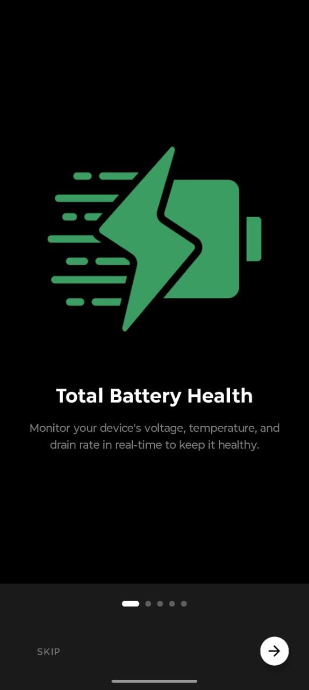
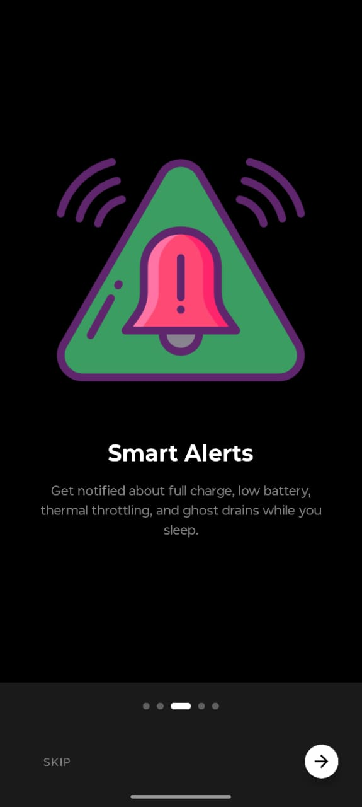
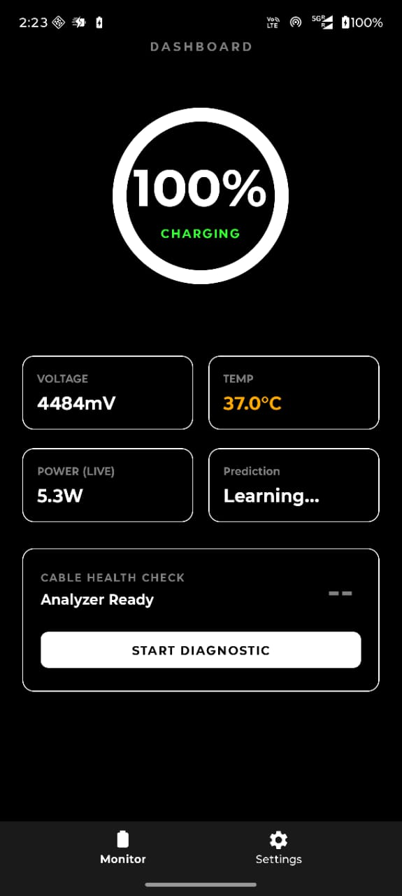
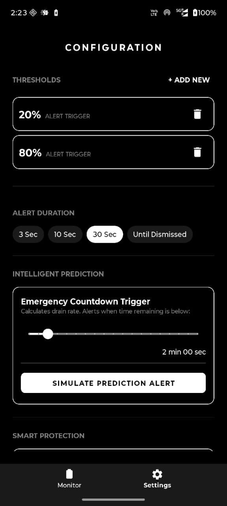

# 🔋 AIO Battery Monitor
### Privacy-First • Intelligent • Offline

 

**The ultimate battery health companion that respects your data.**  
*Crafted by Human Mind (@praveen), Accelerated by AI.*

---

## 🛡️ The Privacy Promise
> **"Your data stays on your device. Period."**

AIO Battery Monitor is built with a strict **Zero-Internet Architecture**.
- ❌ No `android.permission.INTERNET` in the manifest.
- ❌ No Analytics SDKs.
- ❌ No Cloud Backups.
- ❌ No Ad Trackers.

Every calculation, prediction, and log is stored locally using Room Database and DataStore. You can audit the source code to verify.

---

## 📸 App Screenshots

| | | |
|:---:|:---:|:---:|
|  |  |  |
|  |  |  |
| |  | |

---

## 🧠 The Philosophy: Mind First, AI Second
This project represents a new era of software engineering.
- **The Vision & Logic:** Purely Human. The architecture, the safety algorithms, and the user experience were designed by human intuition (@praveen).
- **The Code:** Heavily assisted by AI to ensure modern syntax, bug-free boilerplate, and rapid iteration.

We believe in using AI as a power tool, not the architect.

---

## ⚡ Key Features

| Feature | Description |
| :--- | :--- |
| **🔌 Cable Diagnostic** | Benchmarks your charging cable's quality by analyzing voltage ripple, stability, and wattage throughput. Detects bad cables instantly. |
| **🔮 AI Prediction** | Uses a weighted regression algorithm to predict "Time to Empty" or "Time to Full" based on your actual usage patterns. |
| **👻 Ghost Drain Detective** | Monitors battery loss while the screen is off. Alerts you if background apps are draining power excessively. |
| **🌡️ Thermal Watchdog** | Constantly monitors battery temperature. Triggers an alarm if the device exceeds safe thermal limits (42°C+). |
| **🚨 Emergency Overlay** | A full-screen, high-visibility alert system for critical battery levels or thermal runaways. |
| **🗣️ Smart Alerts** | Customizable triggers using TTS (Voice), Strobe Flash, and Vibration patterns. |

---

## 🛠️ Tech Stack

*   **Language:** Kotlin (Mobile First)
*   **Architecture:** MVVM (Model-View-ViewModel) + Clean Architecture principles
*   **Dependency Injection:** Hilt (Dagger)
*   **Concurrency:** Coroutines & Flow
*   **Local Data:** Room Database & Proto DataStore
*   **UI:** XML ViewBinding with Material Design 3 Components
*   **Background Work:** Foreground Services (Special Use type)

---

## 🤝 Fork & Reuse
This project is open for everyone.
- **Learn:** See how Foreground Services and BatteryManager APIs work.
- **Fork:** Create your own version.
- **Reuse:** Take the `CableBenchmarkEngine` or `PredictionEngine` modules and use them in your app.

**Star this repo if you find it useful!** ⭐