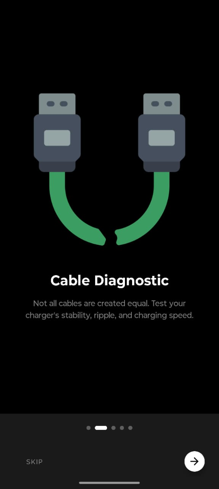
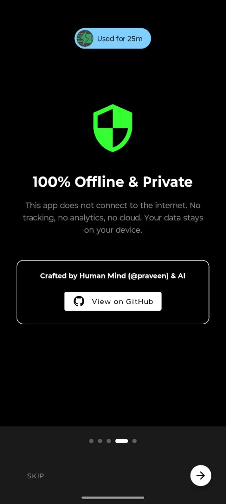
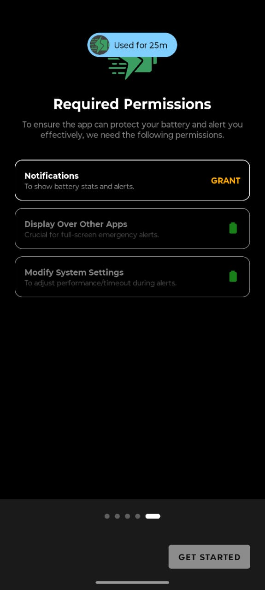

# 🔋 AIO Battery Monitor
### Privacy-First • Intelligent • Offline

 

**The ultimate battery health companion that respects your data.**  
*Crafted by Human Mind (@praveen), Accelerated by AI.*

---

## 🛡️ The Privacy Promise
> **"Your data stays on your device. Period."**

AIO Battery Monitor is built with a strict **Zero-Internet Architecture**.
- ❌ No `android.permission.INTERNET` in the manifest.
- ❌ No Analytics SDKs.
- ❌ No Cloud Backups.
- ❌ No Ad Trackers.

Every calculation, prediction, and log is stored locally using Room Database and DataStore.

---

## 🧠 The Philosophy: Mind First, AI Second
- **Vision & Logic:** Human-designed.
- **Code:** AI-assisted.

---

## ⚡ Key Features

| Feature | Description |
| :--- | :--- |
| **🔌 Cable Diagnostic** | Benchmarks charging cable quality. |
| **🔮 AI Prediction** | Predicts "Time to Empty" / "Time to Full." |
| **👻 Ghost Drain Detective** | Detects background drain while screen is off. |
| **🌡️ Thermal Watchdog** | Tracks battery temperature. |
| **🚨 Emergency Overlay** | Critical alerts system. |
| **🗣️ Smart Alerts** | Voice, flash, vibration triggers. |

---

## 🛠️ Tech Stack

- Kotlin
- MVVM + Clean Architecture
- Hilt
- Coroutines / Flow
- Room + Proto DataStore
- Material 3
- Foreground Services

---

## 🤝 Fork & Reuse

Use any module freely. Star the repo if you vibe with it ⭐

---

## 📸 App Screenshots

|                                               |                                               |                                               |
|:---------------------------------------------:|:---------------------------------------------:|:---------------------------------------------:|
|      |      |      |
|      |      |      |
|                                               |      |                                               |

---
